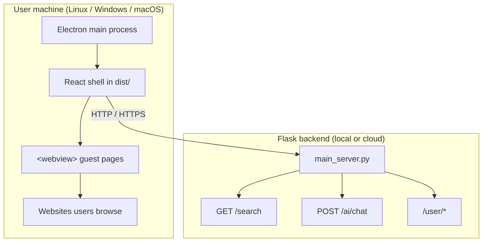

# OpenAiRRo (open source)

**OpenAiRRo** is an **open-source**, minimal desktop web browser built with **Electron**, **React (Vite)**, and a separate **Flask** backend. The shell provides familiar browser chrome (tabs, navigation, omnibox, side panels) and renders pages inside an Electron [`<webview>`](https://www.electronjs.org/docs/latest/api/webview-tag) guest surface.

The project is a **starting point**: the UI covers everyday browsing basics, while the Python API ships with dummy search, streaming AI, and user/auth endpoints you can replace with real providers, databases, and models. **Developers are free to change the backend** (swap Flask for another framework, add persistence, wire cloud services) without being locked into this template’s placeholder logic.

**Deploy the desktop app** on **Linux**, **Windows**, or **macOS** (see [Packaging](#packaging-desktop-installers) and [Further documentation](#further-documentation)). The Flask server runs **locally during development** or **in the cloud** for production builds.

> **If you clone this repo:** the desktop client is wired to a **hosted API** at **[https://airro.online](https://airro.online)** — that domain points to an **AWS server** where Flask is deployed. Search, AI chat, and login in a **built/packaged** app call that host, not your machine. To use **your own** backend, change the API URL (see [Configure the API domain](#configure-the-api-domain-required-for-new-developers) below).

---

## What you get

| Layer | Stack | Role |
|-------|--------|------|
| **Client** | Electron + React | Tabs, toolbar, omnibox, `<webview>` browsing, left/right panels, local profile/history/bookmarks |
| **API** | Flask (`backend/`) | Search results, streaming AI chat, user signup/login, chat metadata (stubs today) |



---

## Features

### Browser shell

- **Tabs**: Multiple tabs; **+** to add, **×** to close; the last tab resets to a fresh home state instead of closing the app.
- **Navigation**: Back, forward, reload, stop; omnibox accepts URLs, host-like strings, or plain text (search flow).
- **Web rendering**: `<webview>` loads real sites; shared guest profile (cookies/storage across tabs).
- **New windows**: `https?` links open in a new in-app tab; other schemes go to the system browser (`setWindowOpenHandler` in the main process).
- **Bookmarks**: Star on HTTP(S) pages; list, remove, and clear-all in the left panel (`localStorage`).
- **History**: Navigations and searches recorded; reopen, per-row delete, or clear-all (`browser-nav-history`).
- **Downloads**: Save to the system Downloads folder (or Save As), progress, cancel, and a download shelf.
- **Home + in-app search**: Results overlay above the webview; middle-click / modifier-click opens in a new tab.
- **Shell UX**: Light/dark theme slider, tab strip, loading/error status line, find-in-page, zoom, print preview.
- **External links**: New-window attempts for normal browsing are handed off to the default OS browser where configured.

### Side panel (`src/pages/LeftNavBar.jsx`)

- **»** / **«** to open or collapse.
- **Profile**: Display name and email (saved in `localStorage`).
- **History** and **Theme**: As above.

### AI panel (`src/pages/RightNavBar.jsx`)

- Per-tab chat thread and draft; open/closed state stored per tab.
- **Enter** to send, **Shift+Enter** for a new line; **Stop** aborts the stream for that tab only.
- Requires the Flask backend (or your replacement API) for search and AI.

### Backend (basic functionality today)

The Flask app in `backend/main_server.py` is **stateless** for search and AI: the client sends full context each request; nothing is stored server-side for those routes until you add a database.

| Endpoint | Method | Purpose |
|----------|--------|---------|
| `/` | GET | Health hint / API overview |
| `/search` | GET | JSON `{ query, results }` for omnibox search UI |
| `/ai/chat` | POST | JSON `{ "messages": [...] }` → streaming **plain text** (dummy stream today) |
| `/user/singup` | POST | Signup stub (OTP placeholder) |
| `/user/login` | POST | Login stub (JWT + user + chat list placeholders) |
| `/user/get_full_chat` | POST | Fetch dummy conversation by `chat_id` |

CORS is enabled for local dev. **Replace** dummy pages, streams, and auth with your own search engine, LLM, and user store when you customize the backend.

---

## Configure the API domain (required for new developers)

This project ships with a **default production API base URL**:

| Setting | Current value |
|---------|----------------|
| Domain | **`https://airro.online`** |
| Backend | Flask on an **AWS** instance (DNS for `airro.online` points there) |

The Electron app uses that URL for **`GET /search`**, **`POST /ai/chat`**, and **`/user/*`** when you run a **production build** (`npm run build` + `npm start` or packaged installers). It is **not** your local `backend/` folder unless you change the client to point at localhost.

**If you download or fork the repo**, you will usually want to:

1. **Deploy your own Flask API** (see `backend_deployment.md`) on AWS, another cloud, or your laptop.
2. **Point the browser at your API** instead of `airro.online` by updating these files:

| File | What to change |
|------|----------------|
| `src/searchNavigation.js` | `SEARCH_API_ORIGIN` — set to your API origin, e.g. `https://api.yourdomain.com` (no trailing slash) |
| `index.html` | Content-Security-Policy `connect-src` — add your HTTPS (and dev `http://127.0.0.1:5000` if you still use local Flask) |
| `vite.config.js` | Dev proxy `target` for `/user` — defaults to `http://127.0.0.1:5000` when you run `npm run backend` locally |

Auth and AI panels use `SEARCH_API_ORIGIN` in production (`src/pages/RightNavBar.jsx`, `src/pages/EnterUser.jsx`). In **dev** (`npm run dev`), `/user` requests go through the Vite proxy to localhost; search/AI still use `SEARCH_API_ORIGIN` unless you change that constant to `http://127.0.0.1:5000` while developing against local Flask only.

After edits, rebuild the UI (`npm run build`) before packaging or `npm start`. Rebuild installers if you ship desktop binaries.

You can also run **only** the local stack: set `SEARCH_API_ORIGIN` to `http://127.0.0.1:5000`, run `npm run backend`, and allow that host in `index.html` CSP — no AWS domain required.

---

## Prerequisites

- **Node.js** 18+ (20+ recommended) and **npm**
- **Python 3** and **pip** (for search, AI, and auth against Flask)
- On **Linux**, extra libraries for Electron may be required — see [Electron Linux documentation](https://www.electronjs.org/docs/latest/development/build-instructions-linux)

---

## Installation

Clone the repository and install dependencies from the project root:

```bash
cd /path/to/web_browser_v3_aws
npm install
pip install -r backend/requirements.txt
```

---

## Development

**Terminal 1 — Electron + React (hot reload):**

```bash
npm run dev
```

1. **Vite** serves the React app at `http://127.0.0.1:5173`.
2. **wait-on** waits for that URL, then **Electron** starts with `VITE_DEV_SERVER_URL` set.
3. DevTools open automatically (detached) for the **shell** window, not each guest `<webview>`.

**Terminal 2 — Flask API (search, AI, auth):**

```bash
npm run backend
```

Runs `backend/main_server.py` on `http://127.0.0.1:5000`. In **dev**, Vite proxies `/user` to that host (`vite.config.js`). For **search and AI**, the shell uses `SEARCH_API_ORIGIN` in `src/searchNavigation.js` (default **`https://airro.online`**) unless you point it at `http://127.0.0.1:5000` for fully local testing.

**Production smoke test (no Vite dev server):**

```bash
npm run build
npm start
```

`npm start` loads `dist/index.html` via `electron/main.js`.

---

## Backend (Flask) — run and customize

### Run locally

```bash
pip install -r backend/requirements.txt
npm run backend
# or: python3 backend/main_server.py
```

### Customize for your product

The `backend/` folder is intentionally small and readable:

- Swap **dummy search** (`DUMMY_PAGES`) for a real API (Google Programmable Search, Bing, self-hosted index, etc.).
- Replace **`_stream_dummy_text`** in `/ai/chat` with calls to OpenAI, Anthropic, or your own model — keep the same contract (POST JSON messages, stream UTF-8 plain text) or change the client in `src/searchNavigation.js` to match.
- Implement **real auth**: hash passwords, persist users in PostgreSQL/MySQL, issue JWTs, and remove dummy OTP/tokens in `/user/*`.
- Run behind **Gunicorn** + HTTPS in production; use env vars for secrets (see `backend_deployment.md`).

You may keep Flask or **rewrite the API** in FastAPI, Node, Go, etc. — then set `SEARCH_API_ORIGIN` (or a future `VITE_API_ORIGIN`) to your HTTPS origin as described in `frontend_deployment.md`.

The reference deployment uses **`airro.online` → AWS + Flask**; your fork should use **your** domain after you deploy.

### What the packager does *not* include

**electron-builder** bundles `electron/` and `dist/` only — **not** Python. Packaged apps call whatever URL is baked into `SEARCH_API_ORIGIN` at build time (today `https://airro.online`). Clonees must change that constant (and CSP) before `npm run build` if they rely on their own server instead of the default AWS host.

---

## Packaging (desktop installers)

This repo includes **electron-builder** config in `package.json`. After `npm run build`:

| Script | Description |
|--------|-------------|
| `npm run pack` | Unpacked app in `release/linux-unpacked/` (quick test) |
| `npm run dist` | Full installers for the current OS |
| `npm run dist -- --linux AppImage` | Linux AppImage |
| `npm run dist -- --linux deb` | Debian package (needs `author`, `homepage`, `linux.maintainer`) |
| `npm run dist -- --win` | Windows `.exe` (build on Windows) |
| `npm run dist -- --mac` | macOS `.dmg` (build on macOS) |

Artifacts land in **`release/`**. For `.deb` builds, set `author`, `homepage`, and `build.linux.maintainer` in `package.json`.

**Run packaged app with full features:** either use the default API at **`https://airro.online`** (AWS Flask must be up), or change `SEARCH_API_ORIGIN` + CSP, rebuild (`npm run build`), repackage, then launch from `release/`. Local-only testing can use `npm run backend` with `SEARCH_API_ORIGIN` set to `http://127.0.0.1:5000`.

Step-by-step packaging notes: **`package-electron.md`**.

---

## Project structure

| Path | Role |
|------|------|
| `electron/main.js` | Main process: `BrowserWindow`, `<webview>` tag, dev URL vs `dist/index.html`, external `window.open` |
| `electron/preload.cjs` | Preload (`contextBridge`, e.g. `browserMeta`) |
| `index.html` | Vite entry; CSP for the shell page |
| `vite.config.js` | Vite; `base: './'` for `file://` in production |
| `src/App.jsx` | Browser UI: tabs, toolbar, webviews, per-tab AI state |
| `src/pages/LeftNavBar.jsx` | Profile, history, bookmarks, theme |
| `src/pages/RightNavBar.jsx` | AI chat panel |
| `src/searchNavigation.js` | Omnibox, search fetch, AI streaming fetch |
| `backend/main_server.py` | Flask API (search, AI, user routes) |
| `backend/requirements.txt` | Python dependencies |

---

## Security notes

- Shell window: `contextIsolation: true`, `nodeIntegration: false`, preload via `contextBridge`.
- Guest pages in `<webview>` have their own security boundary; loading arbitrary URLs carries real risk.
- Do **not** embed cloud API secrets in the Electron app — only public config (API base URL).
- Tighten CORS from `*` before production; review the [Electron security checklist](https://www.electronjs.org/docs/latest/tutorial/security).

---

## Troubleshooting

| Symptom | Things to check |
|--------|------------------|
| Blank window in dev | Port `5173` free; Vite “ready” before Electron starts |
| Blank window after `npm run build && npm start` | `dist/index.html` exists; `base: './'` in `vite.config.js` |
| Search / AI / login fails | Default API is `https://airro.online` (AWS); or run local Flask and set `SEARCH_API_ORIGIN` to `http://127.0.0.1:5000`; check CSP in `index.html` allows your origin |
| `<webview>` missing | `webviewTag: true` in `electron/main.js` |
| Linux Electron won’t start | Install GTK/NSS libs per Electron docs |
| Packaged app missing modules | Add any file imported from `main.js` to `build.files` in `package.json` |

---

## Scripts reference

| Script | Description |
|--------|-------------|
| `npm run dev` | Vite + Electron with HMR |
| `npm run build` | Production React build → `dist/` |
| `npm start` | Electron only; loads `dist/` |
| `npm run preview` | Preview Vite build in a normal browser (no `<webview>`) |
| `npm run backend` | Flask on `127.0.0.1:5000` |
| `npm run pack` | Build + unpacked electron-builder output |
| `npm run dist` | Build + OS installers |

---

## Further documentation

| Document | Contents |
|----------|----------|
| [`react-electron-setup.md`](react-electron-setup.md) | How React + Vite + Electron are wired (dev vs prod, preload, security baseline) |
| [`package-electron.md`](package-electron.md) | electron-builder config, Linux/Windows/macOS artifacts, checklist |
| [`frontend_deployment.md`](frontend_deployment.md) | Ship the desktop client; point builds at staging/production API URLs |
| [`backend_deployment.md`](backend_deployment.md) | Deploy Flask to cloud (Docker, scaling, HTTPS, observability) |
| [`features.md`](features.md) | Existing features and planned additions |

---

## Customization ideas

- Persist sessions via Electron `session` and webview `partition` attributes.
- Replace `<webview>` with **`BrowserView`** for more main-process control.
- Register custom protocol handlers or a local proxy.
- Enable auto-update (e.g. electron-updater) after you ship installers.

---

## License

MIT — see `package.json`.

---

## Acknowledgments

Built with [Electron](https://www.electronjs.org/), [React](https://react.dev/), [Vite](https://vitejs.dev/), and [Flask](https://flask.palletsprojects.com/).
