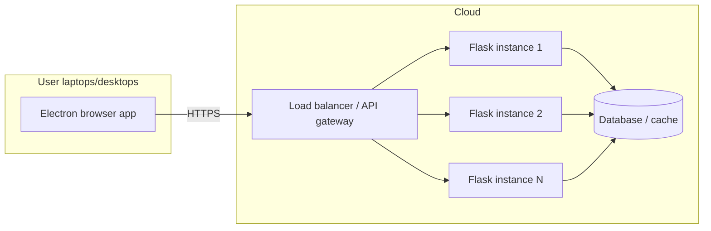

# Backend deployment (Flask on cloud)

The Flask API runs on **cloud servers** and scales horizontally. User machines run only the Electron browser; they call this API over HTTPS.

## Architecture

**API surface today:** `GET /search`, `POST /ai/chat`, and `/user/*` auth routes (see `backend/main_server.py`).

The search and AI routes are **stateless** (client sends full context per request), which suits horizontal scaling. Persisted user/chat data should live in a shared database all instances can reach.

---

## 1. Prepare the backend for production

1. Put Flask behind a production WSGI server (**Gunicorn**, **uWSGI**, or **Waitress**) — not `app.run(debug=True)`.
2. Turn off debug mode and use environment-based config (dev vs prod).
3. Move secrets (JWT keys, DB URLs, AI API keys) to environment variables or a secrets manager — not in source code.
4. Add a **health endpoint** (e.g. `GET /health`) for load balancers and monitoring.
5. If you add a database for users/chats, use a managed DB (RDS, Cloud SQL, Supabase, etc.) that all instances share.

---

## 2. Containerize the backend

1. Write a `Dockerfile` for `backend/` (Python base image, install `requirements.txt`, run Gunicorn).
2. Build and test the image locally.
3. Push the image to a registry (Docker Hub, GHCR, ECR, GCR).

---

## 3. Choose a cloud platform

Pick one (or combine):

| Platform | Good for |
|----------|----------|
| **AWS** (ECS/Fargate, EKS, App Runner) | Full control, enterprise scale |
| **GCP** (Cloud Run, GKE) | Simple container deploy, auto-scale |
| **Azure** (Container Apps, AKS) | Same idea |
| **Railway / Render / Fly.io** | Faster setup, smaller teams |
| **Kubernetes** (any cloud) | Max control when you outgrow PaaS |

Then:

4. Deploy the container with **multiple replicas/instances**.
5. Put a **load balancer** in front (ALB, Cloud Load Balancing, nginx ingress, platform LB).

---

## 4. Scale the API

1. Enable **horizontal autoscaling** (CPU, memory, or request rate).
2. Set min/max instance counts (e.g. 2–20).
3. Use **sticky sessions only if needed** — search/AI routes don’t need them when stateless; JWT auth usually doesn’t either.
4. For **streaming** (`POST /ai/chat`), ensure the load balancer supports long-lived connections (timeouts, no buffering).
5. Add **rate limiting** at the gateway (per IP or per user token) to control cost and abuse.

---

## 5. Domain, HTTPS, and API surface

1. Register an API domain, e.g. `api.yourbrowser.com`.
2. Terminate **TLS/HTTPS** at the load balancer or API gateway (Let’s Encrypt or cloud-managed certs).
3. Expose only HTTPS publicly; block direct HTTP or redirect to HTTPS.
4. Lock down **CORS**: allow your Electron app’s origin(s), not `*` in production.
5. Optionally put an **API gateway** (Kong, AWS API Gateway, Cloudflare) in front for auth, throttling, and logging.

---

## 6. Data and external services

1. Connect Flask to managed **PostgreSQL/MySQL** for users, chat metadata, etc.
2. Use **Redis** for caching, rate-limit counters, or short-lived session data if needed.
3. Wire real **search** and **AI** providers (OpenAI, etc.) via env vars; keep keys on the server only.
4. Set up **backups** and retention for the database.

---

## 7. Observability and ops

1. Centralized **logging** (CloudWatch, Datadog, Grafana Loki).
2. **Metrics**: request latency, error rate, AI token usage, instance count.
3. **Alerts** on 5xx spikes, high latency, or failed health checks.
4. **CI/CD**: push to `main` → build image → deploy to staging → promote to prod.

---

## 8. Environments

1. **Staging API** — e.g. `https://api-staging.yourbrowser.com` for QA.
2. **Production API** — e.g. `https://api.yourbrowser.com`.
3. Staging Electron builds (see `frontend_deployment.md`) point at staging; production builds at prod.

---

## 9. Release workflow (backend)

1. Deploy and test backend on **staging**.
2. Run integration tests against staging (`/search`, streaming `/ai/chat`, `/user/login`, `/user/singup`, etc.).
3. Deploy backend to **production** (rolling or blue-green to avoid downtime).
4. Smoke-test production API before shipping new Electron installers.

---

## 10. Scaling as usage grows

1. Increase max replicas and tune autoscaling rules.
2. Scale DB (read replicas, connection pooling via PgBouncer).
3. Queue heavy AI jobs if streams become too long for sync HTTP.
4. Multi-region deployment only when latency or redundancy requires it.

---

## Minimum viable path

1. Dockerize Flask + Gunicorn.
2. Deploy to Cloud Run / Render / ECS with 2+ instances and an HTTPS domain.
3. Add a managed DB if you persist users/chats.
4. Monitor API; scale replicas as traffic grows.

---

## Gaps to plan for (current repo)

- Flask runs with `debug=True` in `main_server.py` — not suitable for cloud as-is.
- CORS is currently `*` — tighten for production.
- Streaming AI needs load-balancer timeout settings compatible with long responses.
- Auth endpoints will need real persistence and JWT validation once dummy data is replaced.
