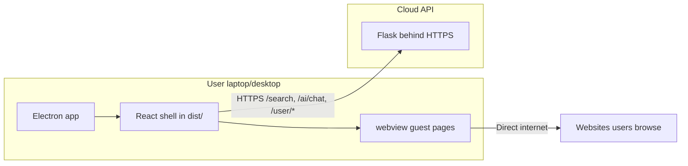

# Frontend deployment (Electron browser on user machines)

The **Electron browser app** runs on user laptops/desktops. It does **not** bundle Python or Flask. All search, AI, and auth calls go to the cloud API (see `backend_deployment.md`).

## Architecture

**What the client owns:** UI, tabs, webview browsing, downloads, local profile/history in `localStorage`, secure token storage.

**What the server owns:** Search, AI streaming, user accounts, databases, API keys.

---

## 1. Point the desktop app at the cloud API

1. Define a **production API base URL**, e.g. `https://api.yourbrowser.com`.
2. Ensure all client calls use that URL in packaged builds:
   - Search: `/search`
   - AI: `/ai/chat`
   - Auth: `/user/login`, `/user/singup`, `/user/get_full_chat`, etc.
3. In dev, Vite proxies `/user` to localhost (`vite.config.js`); in production the app must hit the cloud URL directly (no local Flask).
4. Use build-time env (e.g. `VITE_API_ORIGIN`) or a small config file so staging vs prod can differ without duplicating logic.

**Current behavior:** `src/searchNavigation.js` sets `SEARCH_API_ORIGIN` to `http://127.0.0.1:5000`; auth panels use the same origin in non-dev builds (`EnterUser.jsx`, `RightNavBar.jsx`). Update this before shipping.

---

## 2. Build the desktop app (Electron only)

1. Install dependencies: `npm install`.
2. Build the React UI: `npm run build` → output in `dist/`.
3. Smoke-test locally against staging API: `npm start` (loads `dist/index.html` via `electron/main.js`).
4. Add a packager: **electron-builder** or **Electron Forge** (not included in the template today).
5. Bundle only:
   - `electron/` (main process + preload scripts)
   - `dist/` (Vite production build)
   - App icons and metadata
6. **Do not** bundle Python/Flask — backend lives in the cloud.
7. Keep `vite.config.js` `base: './'` so `file://` asset paths work in the packaged app.

---

## 3. Create installers per OS

1. **Linux**: `.AppImage`, `.deb`, or `.rpm`.
2. **Windows**: `.exe` (NSIS) or portable zip.
3. **macOS**: `.dmg` (+ signing/notarization for wide distribution).
4. Build on each target OS (or use CI runners: `ubuntu`, `windows`, `macos`).

Packager must ship `dist/` next to `electron/` the same way the repo expects: `main.js` resolves `../dist/index.html` when not in dev mode.

---

## 4. Offline and error handling

1. Decide UX when the API is unreachable (disable search/AI/login vs show cached/offline mode).
2. Show clear errors for network failures, 401, and rate limits.
3. Optional: retry with backoff for transient failures.

Browsing via `<webview>` still works offline for already-loaded pages; cloud-backed features need network access.

---

## 5. Auth and security on the client

1. Store JWT/tokens securely (Electron `safeStorage` or OS keychain — avoid plain `localStorage` for sensitive tokens when possible).
2. Send `Authorization: Bearer <token>` on protected routes.
3. Handle token expiry (refresh flow or re-login).
4. **Never** embed cloud API secrets in the Electron app — only public config (API URL).

Review the [Electron security checklist](https://www.electronjs.org/docs/latest/tutorial/security) before distributing an app that loads untrusted URLs in `<webview>`.

---

## 6. Distribute to users

1. Host installers on **GitHub Releases**, your website, or an update server.
2. **Code-sign** Windows and macOS builds to reduce “unknown publisher” warnings.
3. Optional: **auto-update** (electron-updater) so users get new client versions without manual downloads.
4. Publish release notes and minimum OS versions (Node 18+ for dev; Electron bundles its own runtime for users).

On Linux, users may need distro libraries for Electron (GTK, NSS, etc.) — see [Electron Linux docs](https://www.electronjs.org/docs/latest/development/build-instructions-linux).

---

## 7. Environments

1. **Staging build** → `https://api-staging.yourbrowser.com`.
2. **Production build** → `https://api.yourbrowser.com`.
3. Keep API URL in build config, not hardcoded per release artifact.

---

## 8. Release workflow (frontend)

1. Confirm staging/production API is deployed and healthy (see `backend_deployment.md`).
2. Build Electron installers with the correct **production API URL**.
3. Smoke-test installed app against live API (search, AI stream, login).
4. Publish installers (+ optional auto-update manifest).

Typical order: backend to prod → then ship matching Electron build.

---

## Scripts reference

| Script | Description |
|--------|-------------|
| `npm run dev` | Vite + Electron with hot reload (dev API via proxy/localhost). |
| `npm run build` | Production build of the renderer to `dist/`. |
| `npm start` | Electron only; loads `dist/`. |
| `npm run backend` | Local Flask only — **dev convenience**, not used in shipped app. |

---

## Minimum viable path

1. Set production API URL in build config.
2. `npm run build` + electron-builder → Linux/Windows/macOS installers.
3. Upload to GitHub Releases; users download and install.
4. Optional: enable auto-update for subsequent releases.

---

## Gaps to plan for (current repo)

- No packager configured yet (`electron-builder` / Electron Forge not in `package.json`).
- Client still targets `http://127.0.0.1:5000` in production paths — must switch to cloud HTTPS URL.
- Dev relies on Vite proxy for `/user`; production has no proxy — all routes must use the full API base URL.
- Features like auto-update, crash reporting, and multi-window support are not wired yet (`features.md`).
